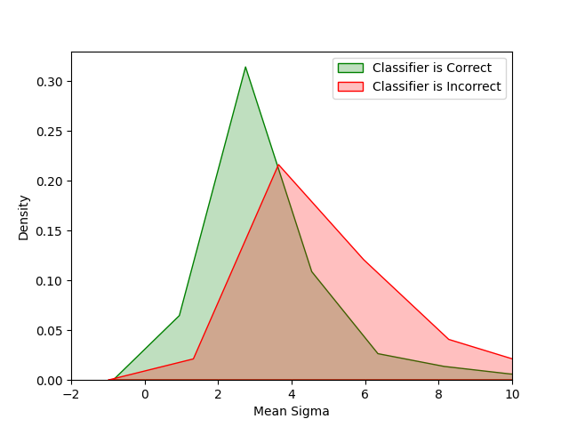
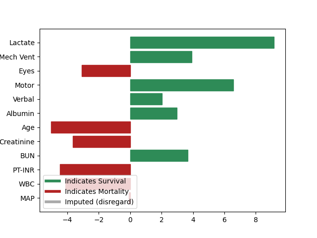
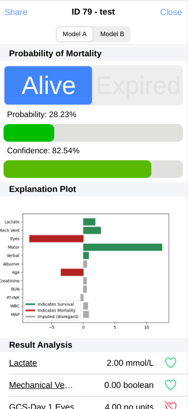
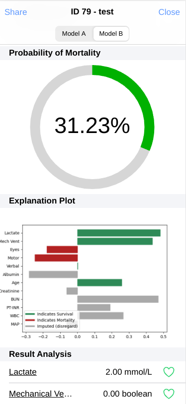
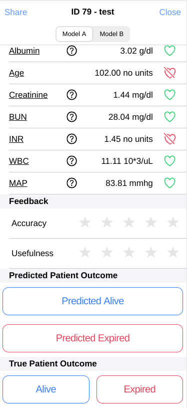

# mortality-tool
This repository contains the code for the modeling backend of the 
ICU mortality prediction app. The modeling effort is largely based
on the previous work by [Epifano, et. al., 2020](https://jrepifano.github.io/papers/towards.pdf).
The main difference is a new feature set chosen by mutual information, and the addition of another type
of neural network. 

Two different neural networks were used to perform inference. 
One normal network (deterministic) and another stochastic type neural network that is
trained using [Variational Density Propagation (VDP)](https://par.nsf.gov/servlets/purl/10161387) similar to 
[Bayes by Backprop](https://arxiv.org/abs/1505.05424). This stochastic network propagates means
and variances through the network. The means are used for inference.
The variances can be used to quantify network uncertainty. 

The above image shows the distribution of the mean sigma value
when the classifier is correct and when it's incorrect. This shows
that on average, the sigma value for each instance is lower when
the network is correct. Using this knowledge, we can create a 
confidence metric by computing at what percentage along the distribution
of all sigmas in the training set does the test instance occur. That is to say, the closer
the sigma value is to zero, the more confident we can say the network is in its decision.
To compute the final confidence score, you just do 100-percentage. 

## Training and Performance

Each model was trained on a combination of [eICU](https://physionet.org/content/eicu-crd/2.0/)
and [MIMIC-III](https://physionet.org/content/mimiciii/1.4/) data. Parameters were optimized in a 
10-fold cross-validation scheme using [weights and biases](https://wandb.ai/site). Our optimization target
was to maximize positive likelihood ratio. A summary of the 10-fold performance with 95% confidence intervals is
provided below. Keep in mind there was a very large class imbalance of about 93% - 7%. The global mortality rate
in any ICU typically ranges between 8 and 12 percent so this is not uncommon. The final positive and negative likelihood
ratios for both of the top performing models were both around 3.5 and 0.22 respectively. 

| Deterministic Network 	|   Precision  	|  Sensitivity 	|  Specificity 	|    ROC AUC   	|    PRC AUC   	| Balanced Accuracy 	|
|:---------------------:	|:------------:	|:------------:	|:------------:	|:------------:	|:------------:	|:-----------------:	|
|       eICU Only       	| 0.21 ±(0.01) 	| 0.79 ±(0.02) 	| 0.82 ±(0.02) 	| 0.89 ±(0.00) 	| 0.43 ±(0.01) 	|    0.81 ±(0.00)   	|
|   eICU and MIMIC-III  	| 0.19 ±(0.00) 	| 0.80 ±(0.00) 	| 0.77 ±(0.00) 	| 0.87 ±(0.00) 	| 0.39 ±(0.00) 	|    0.79 ±(0.00)   	|
|   Stochastic Network  	|   Precision  	|  Sensitivity 	|  Specificity 	|    ROC AUC   	|    PRC AUC   	| Balanced Accuracy 	|
|       eICU Only       	|  0.2 ±(0.01) 	| 0.79 ±(0.02) 	| 0.81 ±(0.02) 	| 0.88 ±(0.00) 	| 0.37 ±(0.02) 	|    0.80 ±(0.00)   	|
|   eICU and MIMIC-III  	| 0.19 ±(0.00) 	| 0.80 ±(0.01) 	| 0.78 ±(0.00) 	| 0.87 ±(0.00) 	| 0.35 ±(0.02) 	|    0.79 ±(0.00)   	|

## Explanations

For these models to give some meaningful utility to clinicians we must provide some kind of explanation of our prediction.
Since a lot of my work has been done on influence functions, that's what I've decided to stick with here. Since
Influence Functions are model agnositc, using them with the stochastic took some minimnal modifications to the code. I used the
same implementation in my [influence-pytorch](https://github.com/jrepifano/influence-pytorch) repository. The values
are normalized amongst themselves and placed in a bar chart, so it's actually interpretable. The directions can
be interpreted as increases/decreases in loss, so, in a binary problem each direction can indicate that a feature
contains information for either class depending on its direction.

## Web App

All of this information is rolled into a pretty robust web app designed by [Stephen Glass](https://github.com/sglass520).
We decided on a web app due to its accessibility. The app is designed to be used by ICU clinicians when evaluating a patient
to determine care. The below images show the UI for input/output as well as all the data we collect as feedback

## App Performance and Perceived Utility

TBD